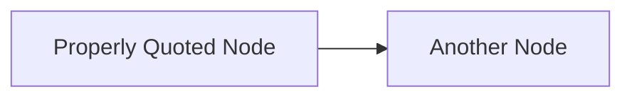
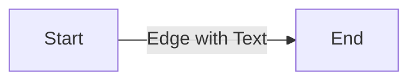
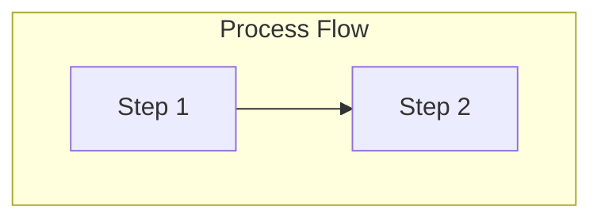
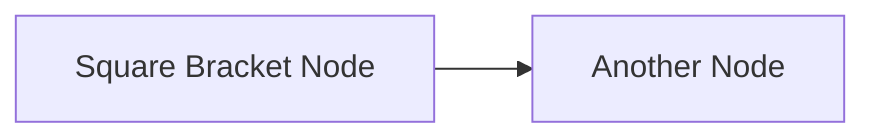
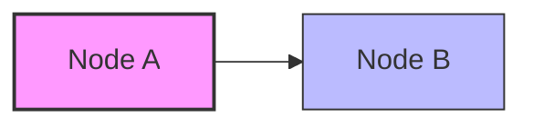
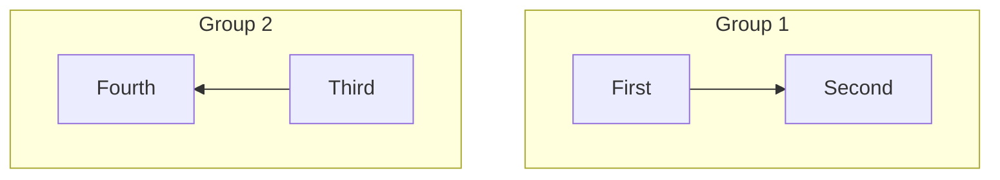
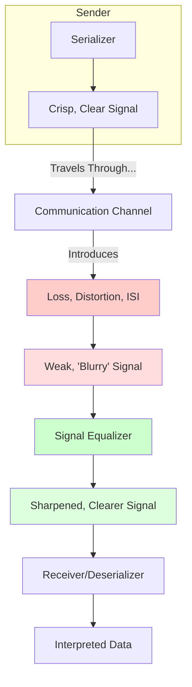

# Mermaid Diagram Syntax Guide

This guide provides standardized syntax rules for creating consistent and properly rendered Mermaid diagrams in markdown files.

## Key Syntax Rules

### 1. Node Labels
Always enclose node labels in double quotes:



❌ Incorrect:
```
A[Unquoted Node] --> B{Curly Braces Node}
```

✅ Correct:
```
A["Properly Quoted Node"] --> B["Square Bracket Node"]
```

### 2. Edge Text
Always enclose edge text in double quotes:



❌ Incorrect:
```
A["Start"] -->|Unquoted Edge Text| B["End"]
```

✅ Correct:
```
A["Start"] -->|"Properly Quoted Edge Text"| B["End"]
```

### 3. Subgraph Titles
Always enclose subgraph titles in double quotes:



❌ Incorrect:
```
subgraph Process Flow
    A["Step 1"] --> B["Step 2"]
end
```

✅ Correct:
```
subgraph "Process Flow"
    A["Step 1"] --> B["Step 2"]
end
```

### 4. Node Definitions
Use square brackets `[]` consistently for node definitions:



❌ Incorrect:
```
A{"Curly Brace Node"} --> B(("Double Parentheses Node"))
```

✅ Correct:
```
A["Properly Formatted Node"] --> B["Another Node"]
```

### 5. Style Consistency
Maintain consistent styling for nodes:



### 6. Direction Statements
Keep direction statements within subgraphs:



## Complete Example

Here's a complete example incorporating all the syntax rules:



## Common Issues and Solutions

| Issue | Solution |
|-------|----------|
| Diagram not rendering | Check for missing quotes around node labels, edge text, or subgraph titles |
| Inconsistent node shapes | Use square brackets `[]` consistently for all nodes |
| Text alignment problems | Ensure proper quoting and avoid special characters in unquoted text |
| Subgraph rendering issues | Always quote subgraph titles and check direction statements |

## Tools for Validation

- [Mermaid Live Editor](https://mermaid.live/): Test your diagrams before adding them to documentation
- VS Code extensions: "Markdown Preview Mermaid Support" and "Mermaid Markdown Syntax Highlighting"

Remember that consistent syntax across all diagrams improves readability and ensures proper rendering across different platforms and viewers.
